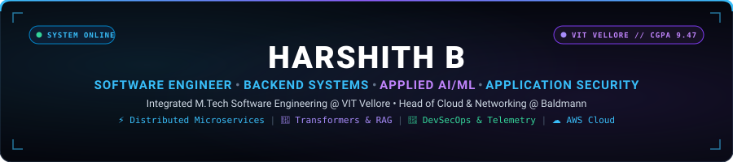
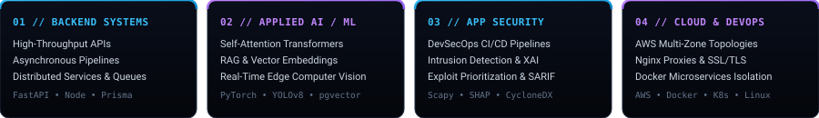
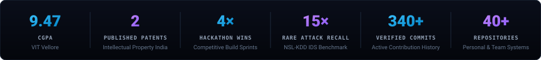

<div align="center">

<!-- ==================== HERO SECTION (SVG BANNER) ==================== -->
<a href="https://harshith-b.vercel.app/">
  
</a>

<br/><br/>

<!-- ==================== CALL-TO-ACTION ROW ==================== -->
[](https://harshith-b.vercel.app/)
&nbsp;
[](https://harshith-b.vercel.app/)
&nbsp;
[](https://github.com/TROJAN1HAMMER)
&nbsp;
[](https://www.linkedin.com/in/harshith-b-02396627/)
&nbsp;
[](mailto:bharshith05@gmail.com)

<br/><br/>

</div>

```text
$ whoami     → harshith-b
$ focus      → backend-systems • applied-ai/ml • application-security
$ stack      → python • typescript • node • fastapi • pytorch • postgresql • aws
$ status     → online & shipping production systems
```

<div align="center">

<!-- ==================== ENGINEERING DOMAINS VISUAL ==================== -->


<br/><br/>

<!-- ==================== VERIFIED METRICS VISUAL ==================== -->


<br/>

</div>

---

### About

I am a Software Engineer and Integrated M.Tech student at **VIT Vellore** (2023–2028, **CGPA: 9.47**). My work centers on building scalable server-side architectures, managing cloud infrastructure, and applying AI/ML and security engineering to real-world software systems.

* **Core Specialization:** High-throughput backend microservices, distributed task queues, applied AI/ML pipelines, and proactive security engineering.
* **Track Record:** Co-inventor of **2 officially published patents** with Intellectual Property India, **4× hackathon winner**, and active campus leadership as an **Executive Council Member** and **Placement Coordinator** at VIT Vellore.
* **Industry Role:** Serving as **Head of Cloud & Networking** and **Senior App Developer** at Baldmann, overseeing AWS server topologies, Nginx networking, containerized deployments, and Flutter applications.

---

### Selected Projects

#### 01. [ArchitectAI](https://github.com/TROJAN1HAMMER/ArchitectureAI) — Multi-Repository Engineering Intelligence Platform
> **Flagship Platform** &nbsp;|&nbsp; `NestJS` · `Next.js` · `PostgreSQL` · `pgvector (HNSW)` · `Redis` · `AST Graph` · `Docker`

* **Problem:** Large multi-repository microservices suffer from architectural drift, circular dependencies, and tribal knowledge loss.
* **Solution:** Engineered a platform that parses AST dependencies, generates dynamic C4 container diagrams, and executes grounded RAG queries with automated sandbox PR remediation.
* **Links:** [GitHub Repository](https://github.com/TROJAN1HAMMER/ArchitectureAI) &nbsp;•&nbsp; [Portfolio Architecture Showcase](https://harshith-b.vercel.app/)

<details>
<summary><b>View System Design &amp; Architectural Pipeline</b></summary>

* **AST Dependency Graphing:** Parses TypeScript/JavaScript ASTs to extract cross-module coupling metrics and untangle circular dependency chains.
* **Vector-Grounded Retrieval:** Implements HNSW vector indexing in pgvector for sub-millisecond semantic search with exact source-file citations.
* **Governed Remediation:** Validates proposed code patches in isolated sandbox runtimes prior to synthesizing GitHub Pull Requests.

</details>

---

#### 02. [Synapse Sentinel](https://github.com/TROJAN1HAMMER/Synapse-Sentinel) — Hybrid Neuro-Fuzzy &amp; Transformer Intrusion Detection
> **Security AI Engine** &nbsp;|&nbsp; `Python` · `PyTorch` · `FastAPI` · `React` · `Scapy` · `XGBoost` · `SHAP (XAI)`

* **Problem:** Traditional signature-based IDS engines fail against zero-day exploits and suffer from high false-positive rates on rare attack traffic.
* **Solution:** Built a 4-phase intrusion detection engine scaling from soft-computing Neuro-Fuzzy (ANFIS) models to a 41-feature Self-Attention Transformer with Scapy packet ingestion and SHAP explainable AI.
* **Benchmark Highlights:** Achieved **96.2% overall accuracy** on the NSL-KDD benchmark with a **15× recall improvement** on rare zero-day attack signatures (U2R/R2L).
* **Links:** [GitHub Repository](https://github.com/TROJAN1HAMMER/Synapse-Sentinel) &nbsp;•&nbsp; [Portfolio Benchmark Showcase](https://harshith-b.vercel.app/)

<details>
<summary><b>View Telemetry Pipeline &amp; Explainability Details</b></summary>

* **Live Packet Ingestion:** Promiscuous packet capture using Scapy extracting 41 statistical and protocol telemetry features in real-time.
* **Sub-Millisecond Attribution:** Integrates TreeSHAP/DeepSHAP to compute feature attribution vectors, providing security analysts with instant root-cause clarity.

</details>

---

#### 03. [Sentinel-X](https://github.com/TROJAN1HAMMER/Kerala-Police-Hack) — AI Multi-Agent Digital Forensics Operating System
> **Forensics OS** &nbsp;|&nbsp; `TypeScript` · `React` · `Tailwind CSS` · `React Flow` · `Multi-Agent Telemetry` · `OSINT`

* **Problem:** Digital forensic investigators struggle to correlate disparate evidence files, OSINT telemetry, and timeline events across complex investigations.
* **Solution:** Developed an enterprise multi-agent digital forensics suite (built for the Kerala Police Cyberdome Hackathon) with interactive React Flow knowledge graphs and verifiable case dossier generation.
* **Links:** [GitHub Repository](https://github.com/TROJAN1HAMMER/Kerala-Police-Hack) &nbsp;•&nbsp; [Portfolio Case Study](https://harshith-b.vercel.app/)

<details>
<summary><b>View Sub-Agent Architecture &amp; Knowledge Graph</b></summary>

* **Interactive Entity Graph:** React Flow node-link network mapping relationships between suspects, devices, geolocation data, and forensic media.
* **Specialist Sub-Agents:** Parallel telemetry streams from Vision, OCR, and NLP agents synthesized by a central supervisor orchestrator.

</details>

---

#### 04. [YOLOv8 Edge Object Detection &amp; IoT Hardware Automation](https://github.com/TROJAN1HAMMER/YOLO_v8_Real-Time-Objection-Detection-with-IoT-Integration)
> **Edge Vision &amp; Hardware** &nbsp;|&nbsp; `Python` · `FastAPI` · `React` · `Vite` · `YOLOv8` · `OpenCV` · `Arduino C++` · `Serial IPC`

* **Problem:** High-speed computer vision systems require low-latency edge inference paired with deterministic hardware actuation protocols.
* **Solution:** Built an asynchronous FastAPI inference service executing real-time object tracking over live webcam streams with a bidirectional serial protocol controlling embedded Arduino microcontrollers.
* **Links:** [GitHub Repository](https://github.com/TROJAN1HAMMER/YOLO_v8_Real-Time-Objection-Detection-with-IoT-Integration)

---

<details>
<summary><b>View Additional Production Systems (KAVACH, AI Vulnerability Intelligence, ICAPOS)</b></summary>

* **KAVACH — AI DevSecOps Platform for Banking Systems:** Automated compliance and threat analysis platform orchestrating SAST, DAST, CycloneDX SBOM analysis, and vector-grounded RAG remediation advisories formatted in unified SARIF for banking regulatory standards (RBI IT / PCI-DSS).  
  *Tech:* `FastAPI` · `React` · `PostgreSQL` · `Redis` · `Celery` · `SARIF` · `CycloneDX`
* **[AI Vulnerability Intelligence Platform](https://github.com/TROJAN1HAMMER/Ai-Proj):** Machine learning pipeline predicting empirical exploit likelihood to dynamically prioritize vulnerability triage for security response teams beyond static CVSS scores.  
  *Tech:* `Python` · `Scikit-learn` · `FastAPI` · `React` · `Microservices`
* **ICAPOS — Full-Stack Inventory & Point-of-Sale System:** Modular retail POS system with relational data models, role-based checkout controls, and real-time inventory synchronization.  
  *Tech:* `React` · `Node.js` · `Express` · `Prisma ORM` · `PostgreSQL`

</details>

---

### System Architecture Topology

<div align="center">
  
</div>

---

### Experience

| Organization | Role | Period | Core Focus |
| :--- | :--- | :--- | :--- |
| **Baldmann** | Head of Cloud &amp; Networking | Nov 2025 – Present | AWS VPCs, Nginx Reverse Proxies, Docker Infrastructure |
| **Baldmann** | Senior App Developer | Nov 2025 – Present | Flutter SDK, Dart, State Management, Local Storage |
| **ISAACS Smartheart Electronics** | Frontend &amp; ML Developer | Aug 2024 – Nov 2024 | User Interfaces, Exploratory Machine Learning Research |
| **Kalkini** | Full Stack Developer | July 2024 – Oct 2024 | Next.js, Node.js, Express, Prisma ORM, PostgreSQL |
| **LumaSpace** | Backend Developer | June 2024 – Aug 2024 | REST APIs, Express Routing, MongoDB, Prisma |

#### Experience Deliverables

* **Baldmann — Head of Cloud &amp; Networking &amp; Senior App Developer** *(Nov 2025 – Present)*
  * Orchestrated multi-zone virtual networks, compute instances, and secure server deployments on AWS (EC2, S3, IAM).
  * Configured Nginx reverse proxies, SSL/TLS handshake security, and granular port forwarding topologies.
  * Containerized microservices using Docker and built cross-platform mobile features with Flutter and Dart.
* **ISAACS Smartheart Electronics — Frontend &amp; ML Developer** *(Aug 2024 – Nov 2024)*
  * Engineered user-facing web interfaces and conducted exploratory research into reaction-based ML models.
* **Kalkini — Full Stack Developer** *(July 2024 – Oct 2024)*
  * Built responsive Next.js/React frontend views and engineered backend endpoints with Node.js, Express, and Prisma ORM on PostgreSQL.
* **LumaSpace — Backend Developer** *(June 2024 – Aug 2024)*
  * Authored modular REST API routes in Express, designed MongoDB models, and optimized queries with Prisma.

---

### Research & Achievements

#### Published Patents (Intellectual Property India)

* **Wearable Multi-Modal Currency Authentication &amp; Denomination Detection System Using Sensor Fusion**  
  *Application No:* `202641062285` &nbsp;|&nbsp; *Status:* **Officially Published (May 29, 2026)** &nbsp;|&nbsp; *Role:* Co-Inventor  
  *Domain:* Sensor Fusion · Assistive Devices · Edge Computing · Embedded Security  
  *Abstract:* Algorithmic framework and wearable assistive hardware utilizing multi-modal sensor fusion, edge classification, and tactile/audio feedback for real-time banknote denomination detection and anti-counterfeiting under variable lighting and wear.

* **System and Method for Predictive Monitoring and Automated Management of Beehive Health**  
  *Application No:* `202641033832` &nbsp;|&nbsp; *Status:* **Officially Published (2026)** &nbsp;|&nbsp; *Role:* Co-Inventor  
  *Domain:* Predictive Telemetry · Acoustic/Thermal Sensor Fusion · Edge IoT Automation  
  *Abstract:* Distributed sensor fusion system monitoring acoustic vibration, internal temperature, and hive weight to predict colony health anomalies and trigger automated environmental interventions.

#### Hackathons & Competitions

* **State &amp; University Build Sprints — Tamil Nadu (4× Winner):** Ranked top podium finishes across multi-college sprint hackathons building high-throughput backend APIs, computer vision pipelines, and Flutter mobile applications.
* **Code-A-Thon Systems Showcase (Winner):** Engineered a secure, high-integrity electronic voting platform in C++ with tamper-evident audit logging, cryptographic receipt generation, and zero-trust voter validation.
* **Kerala Police Cyberdome Hackathon (Project Build):** Architected *Sentinel-X*, a multi-agent digital forensics and OSINT intelligence suite featuring interactive knowledge graph entity linking, OCR/NLP evidence extraction, and automated case dossier synthesis.
* **IIT Kharagpur Competitive Engineering (National Competitor):** Competed in intensive national technical hackathons tackling multi-tier system scalability, edge sensor integration, and real-time distributed data pipelines.

#### Campus Leadership & Governance

* **Executive Member — Student Council / Student Welfare, VIT Vellore** *(2026–2027 Academic Tenure)*: Elected executive governance driving university-wide student welfare policies, administrative liaison, and campus initiatives.
* **Placement Coordinator — VIT Vellore** *(2026–2027 Academic Tenure)*: Coordinating campus recruitment drives, corporate relations, and candidate readiness for engineering cohorts.
* **Technical Head &amp; Vice Head of Cubing — Cubing Club VIT**: Directed technical platforms, digital tournament scoring systems, and club operations.

---

### Technical Stack

| Domain | Core Technologies &amp; Tools |
| :--- | :--- |
| **Languages** | `Python` · `TypeScript` · `JavaScript` · `Java` · `C++` · `C` · `Dart` · `SQL` · `R` |
| **Backend &amp; Distributed** | `FastAPI` · `Node.js` · `Express.js` · `NestJS` · `Django REST` · `Spring Boot` · `Prisma ORM` · `Celery` · `REST APIs` · `JWT & RBAC` |
| **AI / ML &amp; Security** | `PyTorch` · `TensorFlow` · `Transformers` · `YOLOv8` · `LangChain` · `OpenCV` · `Scikit-learn` · `Scapy` · `SHAP (XAI)` · `SARIF` · `CycloneDX` |
| **Databases &amp; Storage** | `PostgreSQL` · `pgvector (HNSW)` · `MongoDB` · `Redis (Caching & Queues)` · `ChromaDB` · `MySQL` · `Firebase` |
| **Cloud &amp; DevOps** | `AWS (EC2 / S3 / IAM)` · `Docker` · `Kubernetes` · `Jenkins (CI/CD)` · `Nginx` · `Linux (Ubuntu/Debian)` · `GitHub Actions` |
| **Frontend &amp; Mobile** | `React` · `Next.js` · `Tailwind CSS` · `React Flow` · `Flutter SDK` · `Vite` · `HTML5 / CSS3` |

---

### Currently Building

* **● ACTIVE DEVELOPMENT:** Multi-Agent Engineering Intelligence platform (AST dependency graphing, sandbox code remediation) and Banking DevSecOps compliance scanners (CycloneDX SBOMs + SARIF advisories).
* **○ TECHNICAL EXPLORATION:** Distributed consensus algorithms (Raft state machines, WAL persistence) and kernel-level eBPF packet inspection for zero-overhead application telemetry.

---

### GitHub Activity &amp; Telemetry

<div align="center">


&nbsp;


<br/><br/>


<br/><br/>

| 📅 365-Day Contribution Heatmap |
| :---: |
| [](https://github.com/TROJAN1HAMMER) |

<br/>

| 🐍 Contribution Activity Snake |
| :---: |
|  |

</div>

#### Recent Engineering Activity
> <sub>*Maintained automatically via scheduled GitHub Actions telemetry.*</sub>

<!-- DYNAMIC_ACTIVITY:START -->

<table width="100%">
    <tr>
      <td width="80" align="center"><code>Commit</code></td>
      <td>Pushed updates to <a href='https://github.com/TROJAN1HAMMER/TROJAN1HAMMER'><b>TROJAN1HAMMER</b></a></td>
      <td width="90" align="right"><sub>5d ago</sub></td>
    </tr>
    <tr>
      <td width="80" align="center"><code>Create</code></td>
      <td>Created branch <code>main</code> on <a href='https://github.com/TROJAN1HAMMER/OneGramTechnician'><b>OneGramTechnician</b></a></td>
      <td width="90" align="right"><sub>21d ago</sub></td>
    </tr>
  </table>

<!-- DYNAMIC_ACTIVITY:END -->

---

### Open Source &amp; Collaboration

| Active Repositories | Verified Commits | Multi-Repo Contributions | Team Architecture |
| :---: | :---: | :---: | :---: |
| **40+ Repos** | **340+ Commits** | **PRs, Issues &amp; Forks** | **Microservices, RAG &amp; Apps** |

---

### Contact

<div align="center">

I am open to discuss **Software Engineering**, **Backend Systems Architecture**, **Distributed Computing**, and **Applied AI / ML** opportunities.

<br/>

[](https://harshith-b.vercel.app/)

<br/><br/>

[](mailto:bharshith05@gmail.com)
&nbsp;
[](https://www.linkedin.com/in/harshith-b-02396627/)
&nbsp;
[](https://github.com/TROJAN1HAMMER)

<br/><br/>

<sub>Harshith B • Integrated M.Tech Software Engineering @ VIT Vellore • <a href="https://harshith-b.vercel.app/">harshith-b.vercel.app</a></sub>

</div>
