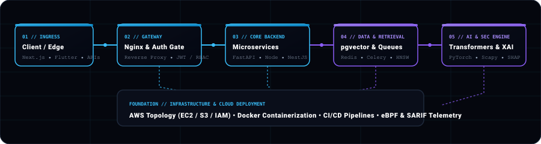

<!-- ==================== HERO SECTION ==================== -->

  

  Integrated M.Tech Software Engineering student at <strong>VIT Vellore</strong> (CGPA: <strong>9.47</strong>). 
  Specializing in scalable backend microservices, applied AI/ML architectures, and proactive security engineering.

 

<!-- ==================== CALL-TO-ACTION BAR ==================== -->

&nbsp;

&nbsp;

&nbsp;

&nbsp;

  

<!-- ==================== TERMINAL ACCENT ==================== -->
<table align="center" width="92%">
  <tr>
    <td style="background-color: #05070E; border: 1px solid #1E293B; border-left: 4px solid #38BDF8; padding: 12px 18px; border-radius: 8px;">
      <pre style="margin: 0; font-family: 'Fira Code', monospace; font-size: 12px; line-height: 1.6; color: #94A3B8;">$ whoami     → harshith-b
$ focus      → backend-systems • applied-ai/ml • application-security
$ stack      → python • typescript • node • fastapi • pytorch • postgresql • aws
$ status     → ● online &amp; shipping production systems</pre>
    </td>
  </tr>
</table>

 

<!-- ==================== ENGINEERING IDENTITY BLOCK ==================== -->
<table align="center" width="100%">
  <tr>
    <td width="25%" valign="top" style="border-left: 3px solid #38BDF8; padding: 10px 14px; background: #080C16;">
      <strong style="color: #38BDF8; font-size: 11px;">01 // BACKEND SYSTEMS</strong> 
      High-throughput APIs · Async pipelines · Distributed microservices
    </td>
    <td width="25%" valign="top" style="border-left: 3px solid #8B5CF6; padding: 10px 14px; background: #080C16;">
      <strong style="color: #A78BFA; font-size: 11px;">02 // APPLIED AI</strong> 
      Transformers · RAG architectures · Computer Vision · Edge inference
    </td>
    <td width="25%" valign="top" style="border-left: 3px solid #38BDF8; padding: 10px 14px; background: #080C16;">
      <strong style="color: #38BDF8; font-size: 11px;">03 // SECURITY</strong> 
      DevSecOps · Threat prioritization · Intrusion detection · SARIF
    </td>
    <td width="25%" valign="top" style="border-left: 3px solid #8B5CF6; padding: 10px 14px; background: #080C16;">
      <strong style="color: #A78BFA; font-size: 11px;">04 // CLOUD</strong> 
      AWS (EC2/S3) · Docker · Kubernetes · Linux networking · CI/CD
    </td>
  </tr>
</table>

 

<!-- ==================== VERIFIED METRICS ==================== -->
<table align="center" width="100%">
  <tr>
    <td align="center" width="20%" style="background: #080C16; padding: 12px; border-bottom: 2px solid #38BDF8;">
      9.47 
      CGPA • VIT VELLORE
    </td>
    <td align="center" width="20%" style="background: #080C16; padding: 12px; border-bottom: 2px solid #8B5CF6;">
      2 
      PUBLISHED PATENTS
    </td>
    <td align="center" width="20%" style="background: #080C16; padding: 12px; border-bottom: 2px solid #38BDF8;">
      4× 
      HACKATHON WINS
    </td>
    <td align="center" width="20%" style="background: #080C16; padding: 12px; border-bottom: 2px solid #8B5CF6;">
      340+ 
      VERIFIED COMMITS
    </td>
    <td align="center" width="20%" style="background: #080C16; padding: 12px; border-bottom: 2px solid #38BDF8;">
      40+ 
      REPOSITORIES
    </td>
  </tr>
</table>

---

### About

I am a Software Engineer and Integrated M.Tech student at **VIT Vellore** (2023–2028, **CGPA: 9.47**). My work centers on building scalable server-side architectures, managing cloud infrastructure, and applying AI/ML and security engineering to real-world software systems.

* **Core Focus:** High-throughput backend systems, distributed microservices, model-driven AI applications, and proactive security telemetry.
* **Track Record:** Co-inventor of **2 officially published patents** with Intellectual Property India, **4× hackathon winner**, and active campus leadership as an **Executive Council Member** and **Placement Coordinator** at VIT Vellore.
* **Industry Role:** Serving as **Head of Cloud & Networking** and **Senior App Developer** at Baldmann, overseeing AWS server topologies, Nginx networking, containerized deployments, and Flutter applications.

---

### Selected Projects

<table width="100%">
  <tr>
    <td style="border-left: 4px solid #38BDF8; padding: 16px; background: #080C16;">
      <table width="100%" style="border: none;">
        <tr>
          <td>
            <h3 style="margin: 0; color: #FFFFFF;"><a href="https://github.com/TROJAN1HAMMER/ArchitectureAI" style="color: #38BDF8; text-decoration: none;">01. ArchitectAI</a> — Multi-Repository Engineering Intelligence Platform</h3>
          </td>
          <td align="right">
            FLAGSHIP SYSTEM
          </td>
        </tr>
      </table>
      

        <strong>Problem:</strong> Multi-repository architectures suffer from architectural drift, circular dependencies, and tribal knowledge loss. 
        <strong>Solution:</strong> Engineered a platform that parses AST dependencies, generates dynamic C4 container models, and executes grounded RAG queries with automated sandbox PR remediation.
      

      

        <strong>Tech:</strong> <code>NestJS</code> · <code>Next.js</code> · <code>PostgreSQL</code> · <code>pgvector (HNSW)</code> · <code>Redis</code> · <code>AST Graph</code> · <code>Docker</code>
      

      

        <a href="https://github.com/TROJAN1HAMMER/ArchitectureAI" style="color: #38BDF8; font-weight: bold;">GitHub Repository</a> &nbsp;•&nbsp; 
        <a href="https://harshith-b.vercel.app/" style="color: #A78BFA; font-weight: bold;">Portfolio Architecture Showcase</a>
      

      

        
<b>View System Design &amp; Architectural Pipeline</b>

        <ul style="margin-top: 6px; padding-left: 18px;">
          <li><strong>AST Dependency Graphing:</strong> Parses TypeScript/JavaScript ASTs to extract cross-module coupling metrics and untangle circular dependency chains.</li>
          <li><strong>Vector-Grounded Retrieval:</strong> Implements HNSW vector indexing in pgvector for sub-millisecond semantic search with exact source-file citations.</li>
          <li><strong>Governed Remediation:</strong> Validates proposed code patches in isolated sandbox runtimes prior to synthesizing GitHub Pull Requests.</li>
        </ul>
      

    </td>
  </tr>
</table>

 

<table width="100%">
  <tr>
    <td style="border-left: 4px solid #8B5CF6; padding: 16px; background: #080C16;">
      <table width="100%" style="border: none;">
        <tr>
          <td>
            <h3 style="margin: 0; color: #FFFFFF;"><a href="https://github.com/TROJAN1HAMMER/Synapse-Sentinel" style="color: #A78BFA; text-decoration: none;">02. Synapse Sentinel</a> — Hybrid Neuro-Fuzzy &amp; Transformer Intrusion Detection</h3>
          </td>
          <td align="right">
            15× RARE ATTACK RECALL
          </td>
        </tr>
      </table>
      

        <strong>Problem:</strong> Traditional signature-based IDS engines fail against zero-day exploits and suffer from high false-positive rates on rare attack traffic. 
        <strong>Solution:</strong> Built a 4-phase intrusion detection engine scaling from soft-computing Neuro-Fuzzy (ANFIS) models to a 41-feature Self-Attention Transformer with Scapy packet ingestion and SHAP explainable AI.
      

      

        <strong>Tech:</strong> <code>Python</code> · <code>PyTorch</code> · <code>FastAPI</code> · <code>React</code> · <code>Scapy</code> · <code>XGBoost</code> · <code>SHAP (XAI)</code>
      

      

        <a href="https://github.com/TROJAN1HAMMER/Synapse-Sentinel" style="color: #38BDF8; font-weight: bold;">GitHub Repository</a> &nbsp;•&nbsp; 
        <a href="https://harshith-b.vercel.app/" style="color: #A78BFA; font-weight: bold;">Portfolio Benchmark Showcase</a>
      

      

        
<b>View Benchmark Results &amp; Telemetry Details</b>

        <ul style="margin-top: 6px; padding-left: 18px;">
          <li><strong>Benchmark Performance:</strong> Achieved <strong>96.2% overall accuracy</strong> on the NSL-KDD benchmark with a 15-fold recall improvement on rare attack signatures (U2R/R2L).</li>
          <li><strong>Live Packet Sniffing &amp; XAI:</strong> Promiscuous packet ingestion via Scapy paired with real-time SHAP attribution for sub-millisecond explainable alerts.</li>
        </ul>
      

    </td>
  </tr>
</table>

 

<table width="100%">
  <tr>
    <td style="border-left: 4px solid #38BDF8; padding: 16px; background: #080C16;">
      <table width="100%" style="border: none;">
        <tr>
          <td>
            <h3 style="margin: 0; color: #FFFFFF;"><a href="https://github.com/TROJAN1HAMMER/Kerala-Police-Hack" style="color: #38BDF8; text-decoration: none;">03. Sentinel-X</a> — AI Multi-Agent Digital Forensics Operating System</h3>
          </td>
          <td align="right">
            KERALA POLICE CYBERDOME
          </td>
        </tr>
      </table>
      

        <strong>Problem:</strong> Digital forensic investigators struggle to correlate disparate evidence files, OSINT telemetry, and timeline events across complex investigations. 
        <strong>Solution:</strong> Developed an enterprise multi-agent digital forensics suite (Kerala Police Cyberdome Hackathon) with interactive React Flow knowledge graphs and verifiable case dossier generation.
      

      

        <strong>Tech:</strong> <code>TypeScript</code> · <code>React</code> · <code>Tailwind CSS</code> · <code>React Flow</code> · <code>Multi-Agent Telemetry</code> · <code>OSINT</code>
      

      

        <a href="https://github.com/TROJAN1HAMMER/Kerala-Police-Hack" style="color: #38BDF8; font-weight: bold;">GitHub Repository</a> &nbsp;•&nbsp; 
        <a href="https://harshith-b.vercel.app/" style="color: #A78BFA; font-weight: bold;">Portfolio Case Study</a>
      

      

        
<b>View Sub-Agent Architecture &amp; Knowledge Graph</b>

        <ul style="margin-top: 6px; padding-left: 18px;">
          <li><strong>Interactive Entity Graph:</strong> React Flow node-link network mapping relationships between suspects, devices, geolocation data, and forensic media.</li>
          <li><strong>Specialist Sub-Agents:</strong> Parallel telemetry streams from Vision, OCR, and NLP agents synthesized by a central supervisor orchestrator.</li>
        </ul>
      

    </td>
  </tr>
</table>

 

<table width="100%">
  <tr>
    <td style="border-left: 4px solid #8B5CF6; padding: 16px; background: #080C16;">
      <table width="100%" style="border: none;">
        <tr>
          <td>
            <h3 style="margin: 0; color: #FFFFFF;"><a href="https://github.com/TROJAN1HAMMER/YOLO_v8_Real-Time-Objection-Detection-with-IoT-Integration" style="color: #A78BFA; text-decoration: none;">04. YOLOv8 Edge Object Detection &amp; IoT Hardware Automation</a></h3>
          </td>
          <td align="right">
            EDGE CV + SERIAL IPC
          </td>
        </tr>
      </table>
      

        <strong>Problem:</strong> High-speed computer vision systems require low-latency edge inference paired with deterministic hardware actuator protocols. 
        <strong>Solution:</strong> Built an asynchronous FastAPI inference service executing real-time object tracking over live webcam streams with a bidirectional serial protocol controlling embedded Arduino microcontrollers.
      

      

        <strong>Tech:</strong> <code>Python</code> · <code>FastAPI</code> · <code>React</code> · <code>Vite</code> · <code>YOLOv8</code> · <code>OpenCV</code> · <code>Arduino C++</code> · <code>Serial IPC</code>
      

      

        <a href="https://github.com/TROJAN1HAMMER/YOLO_v8_Real-Time-Objection-Detection-with-IoT-Integration" style="color: #38BDF8; font-weight: bold;">GitHub Repository</a>
      

    </td>
  </tr>
</table>

 

<b>View Additional Production Systems (KAVACH, AI Vulnerability Intelligence, ICAPOS)</b>

 

* **KAVACH — AI DevSecOps Platform for Banking Systems:** Automated compliance and threat analysis platform orchestrating SAST, DAST, CycloneDX SBOM analysis, and vector-grounded RAG remediation advisories formatted in unified SARIF for banking regulatory standards (RBI IT / PCI-DSS).  
  *Tech:* `FastAPI` · `React` · `PostgreSQL` · `Redis` · `Celery` · `SARIF` · `CycloneDX`
* **[AI Vulnerability Intelligence Platform](https://github.com/TROJAN1HAMMER/Ai-Proj):** Machine learning pipeline predicting empirical exploit likelihood to dynamically prioritize vulnerability triage for security response teams beyond static CVSS scores.  
  *Tech:* `Python` · `Scikit-learn` · `FastAPI` · `React` · `Microservices`
* **ICAPOS — Full-Stack Inventory & Point-of-Sale System:** Modular retail POS system with relational data models, role-based checkout controls, and real-time inventory synchronization.  
  *Tech:* `React` · `Node.js` · `Express` · `Prisma ORM` · `PostgreSQL`

---

### System Architecture Topology

  

---

### Experience

<table width="100%">
  <tr>
    <td style="border-left: 3px solid #38BDF8; padding: 12px 16px; background: #080C16;">
      <table width="100%" style="border: none;">
        <tr>
          <td><strong style="color: #FFFFFF; font-size: 14px;">Baldmann</strong> — Head of Cloud &amp; Networking</td>
          <td align="right">Nov 2025 – Present</td>
        </tr>
      </table>
      <ul style="margin: 6px 0 0 0; padding-left: 18px; color: #CBD5E1; font-size: 12.5px; line-height: 1.5;">
        <li>Orchestrated multi-zone virtual networks, compute instances, and secure server deployments on AWS (EC2, S3, IAM).</li>
        <li>Configured Nginx reverse proxies, SSL/TLS handshake security, and granular port forwarding topologies.</li>
        <li>Implemented system monitoring metrics and containerized backend services using Docker for infrastructure stability.</li>
      </ul>
    </td>
  </tr>
</table>

 

<table width="100%">
  <tr>
    <td style="border-left: 3px solid #8B5CF6; padding: 12px 16px; background: #080C16;">
      <table width="100%" style="border: none;">
        <tr>
          <td><strong style="color: #FFFFFF; font-size: 14px;">Baldmann</strong> — Senior App Developer</td>
          <td align="right">Nov 2025 – Present</td>
        </tr>
      </table>
      <ul style="margin: 6px 0 0 0; padding-left: 18px; color: #CBD5E1; font-size: 12.5px; line-height: 1.5;">
        <li>Architected scalable cross-platform mobile features using Flutter and Dart with clean state isolation.</li>
        <li>Integrated real-time database endpoints, authentication pipelines, and optimized local persistent storage.</li>
      </ul>
    </td>
  </tr>
</table>

 

<table width="100%">
  <tr>
    <td style="border-left: 3px solid #38BDF8; padding: 12px 16px; background: #080C16;">
      <table width="100%" style="border: none;">
        <tr>
          <td><strong style="color: #FFFFFF; font-size: 14px;">ISAACS Smartheart Electronics</strong> — Frontend &amp; ML Developer</td>
          <td align="right">Aug 2024 – Nov 2024</td>
        </tr>
      </table>
      <ul style="margin: 6px 0 0 0; padding-left: 18px; color: #CBD5E1; font-size: 12.5px; line-height: 1.5;">
        <li>Engineered user-facing web interfaces and conducted exploratory research into reaction-based machine learning models.</li>
      </ul>
    </td>
  </tr>
</table>

 

<table width="100%">
  <tr>
    <td style="border-left: 3px solid #8B5CF6; padding: 12px 16px; background: #080C16;">
      <table width="100%" style="border: none;">
        <tr>
          <td><strong style="color: #FFFFFF; font-size: 14px;">Kalkini</strong> — Full Stack Developer</td>
          <td align="right">July 2024 – Oct 2024</td>
        </tr>
      </table>
      <ul style="margin: 6px 0 0 0; padding-left: 18px; color: #CBD5E1; font-size: 12.5px; line-height: 1.5;">
        <li>Built responsive Next.js/React frontend views and engineered backend endpoints with Node.js, Express, and Prisma ORM on PostgreSQL.</li>
      </ul>
    </td>
  </tr>
</table>

 

<table width="100%">
  <tr>
    <td style="border-left: 3px solid #38BDF8; padding: 12px 16px; background: #080C16;">
      <table width="100%" style="border: none;">
        <tr>
          <td><strong style="color: #FFFFFF; font-size: 14px;">LumaSpace</strong> — Backend Developer</td>
          <td align="right">June 2024 – Aug 2024</td>
        </tr>
      </table>
      <ul style="margin: 6px 0 0 0; padding-left: 18px; color: #CBD5E1; font-size: 12.5px; line-height: 1.5;">
        <li>Authored modular REST API routes in Express, designed MongoDB models, and handled database query optimizations with Prisma.</li>
      </ul>
    </td>
  </tr>
</table>

---

### Research & Achievements

#### Published Patents (Intellectual Property India)

<table width="100%">
  <tr>
    <td width="50%" valign="top" style="border-top: 2px solid #38BDF8; background: #080C16; padding: 14px;">
      APPLICATION NO. 202641062285 
      <strong style="color: #FFFFFF; font-size: 13px;">Wearable Multi-Modal Currency Authentication &amp; Denomination Detection System Using Sensor Fusion</strong> 
      OFFICIALLY PUBLISHED (29 May 2026) • Co-Inventor
      

        Algorithmic framework and wearable assistive hardware utilizing multi-modal sensor fusion, edge classification, and tactile/audio feedback for real-time banknote denomination detection and anti-counterfeiting.
      

    </td>
    <td width="50%" valign="top" style="border-top: 2px solid #8B5CF6; background: #080C16; padding: 14px;">
      APPLICATION NO. 202641033832 
      <strong style="color: #FFFFFF; font-size: 13px;">System and Method for Predictive Monitoring and Automated Management of Beehive Health</strong> 
      OFFICIALLY PUBLISHED (2026) • Co-Inventor
      

        Distributed sensor fusion system monitoring acoustic vibration, internal temperature, and hive weight to predict colony health anomalies and trigger automated environmental interventions.
      

    </td>
  </tr>
</table>

#### Hackathons & Competitions (4x Winner)

* **Code-A-Thon Systems Showcase (Winner):** Engineered a secure, high-integrity electronic voting platform in C++ with tamper-evident audit logging, cryptographic receipt generation, and zero-trust voter validation.
* **State & University Build Sprints — Tamil Nadu (4× Winner):** Ranked top podium finishes across multi-college sprint hackathons building high-throughput backend APIs, computer vision pipelines, and Flutter mobile applications.
* **Kerala Police Cyberdome Hackathon (Project Build):** Architected *Sentinel-X*, a multi-agent digital forensics and OSINT intelligence suite featuring interactive knowledge graph entity linking, OCR/NLP evidence extraction, and automated case dossier synthesis.
* **IIT Kharagpur Competitive Engineering (National Competitor):** Competed in intensive national technical hackathons tackling multi-tier system scalability, edge sensor integration, and real-time distributed data pipelines.

#### Campus Leadership & Governance

* **Executive Member — Student Council / Student Welfare, VIT Vellore** *(2026–2027 Academic Tenure)*: Elected executive governance driving university-wide student welfare policies, administrative liaison, and campus initiatives.
* **Placement Coordinator — VIT Vellore** *(2026–2027 Academic Tenure)*: Coordinating campus recruitment drives, corporate relations, and candidate readiness for engineering cohorts.
* **Technical Head & Vice Head of Cubing — Cubing Club VIT**: Directed technical platforms, digital tournament scoring systems, and club operations.

---

### Technical Stack

<table width="100%">
  <tr>
    <td width="22%" style="border-left: 3px solid #38BDF8; background: #080C16; padding: 8px 12px;"><strong style="color: #38BDF8; font-size: 11px;">LANGUAGES</strong></td>
    <td style="background: #080C16; padding: 8px 12px; color: #CBD5E1; font-family: monospace; font-size: 12px;">Python · TypeScript · JavaScript · Java · C++ · C · Dart · SQL · R</td>
  </tr>
  <tr>
    <td width="22%" style="border-left: 3px solid #8B5CF6; background: #080C16; padding: 8px 12px;"><strong style="color: #A78BFA; font-size: 11px;">BACKEND &amp; DISTRIBUTED</strong></td>
    <td style="background: #080C16; padding: 8px 12px; color: #CBD5E1; font-family: monospace; font-size: 12px;">FastAPI · Node.js · Express.js · NestJS · Django REST · Spring Boot · Prisma ORM · Celery · REST APIs · JWT &amp; RBAC</td>
  </tr>
  <tr>
    <td width="22%" style="border-left: 3px solid #38BDF8; background: #080C16; padding: 8px 12px;"><strong style="color: #38BDF8; font-size: 11px;">AI / ML &amp; SECURITY</strong></td>
    <td style="background: #080C16; padding: 8px 12px; color: #CBD5E1; font-family: monospace; font-size: 12px;">PyTorch · TensorFlow · Transformers · YOLOv8 · LangChain · OpenCV · Scikit-learn · Scapy · SHAP (XAI) · SARIF · CycloneDX</td>
  </tr>
  <tr>
    <td width="22%" style="border-left: 3px solid #8B5CF6; background: #080C16; padding: 8px 12px;"><strong style="color: #A78BFA; font-size: 11px;">DATABASES &amp; STORAGE</strong></td>
    <td style="background: #080C16; padding: 8px 12px; color: #CBD5E1; font-family: monospace; font-size: 12px;">PostgreSQL · pgvector (HNSW) · MongoDB · Redis (Caching &amp; Queues) · ChromaDB · MySQL · Firebase</td>
  </tr>
  <tr>
    <td width="22%" style="border-left: 3px solid #38BDF8; background: #080C16; padding: 8px 12px;"><strong style="color: #38BDF8; font-size: 11px;">CLOUD &amp; DEVOPS</strong></td>
    <td style="background: #080C16; padding: 8px 12px; color: #CBD5E1; font-family: monospace; font-size: 12px;">AWS (EC2 / S3 / IAM) · Docker · Kubernetes · Jenkins (CI/CD) · Nginx · Linux (Ubuntu/Debian) · GitHub Actions</td>
  </tr>
  <tr>
    <td width="22%" style="border-left: 3px solid #8B5CF6; background: #080C16; padding: 8px 12px;"><strong style="color: #A78BFA; font-size: 11px;">FRONTEND &amp; MOBILE</strong></td>
    <td style="background: #080C16; padding: 8px 12px; color: #CBD5E1; font-family: monospace; font-size: 12px;">React · Next.js · Tailwind CSS · React Flow · Flutter SDK · Vite · HTML5 / CSS3</td>
  </tr>
</table>

---

### Currently Building

<table width="100%">
  <tr>
    <td width="50%" valign="top" style="border-left: 3px solid #34D399; background: #080C16; padding: 12px 16px;">
      ● ACTIVE DEVELOPMENT
      <ul style="margin: 6px 0 0 0; padding-left: 18px; color: #CBD5E1; font-size: 12px;">
        <li><strong>Multi-Agent Engineering Intelligence:</strong> AST dependency graphing and automated sandbox code remediation engines.</li>
        <li><strong>Banking DevSecOps Scanners:</strong> Asynchronous compliance pipelines integrating CycloneDX SBOMs and SARIF advisories.</li>
      </ul>
    </td>
    <td width="50%" valign="top" style="border-left: 3px solid #38BDF8; background: #080C16; padding: 12px 16px;">
      ○ TECHNICAL EXPLORATION
      <ul style="margin: 6px 0 0 0; padding-left: 18px; color: #CBD5E1; font-size: 12px;">
        <li><strong>Distributed Consensus &amp; Storage:</strong> Raft state machines and WAL implementations for high-concurrency systems.</li>
        <li><strong>Kernel-Level Telemetry:</strong> eBPF packet inspection for zero-overhead application observability and defensive forensics.</li>
      </ul>
    </td>
  </tr>
</table>

---

### GitHub Activity &amp; Telemetry

&nbsp;

  

  

<table width="100%">
  <thead>
    <tr>
      <th align="center" style="background: #080C16; color: #38BDF8; font-size: 12px;">365-Day Contribution Heatmap</th>
    </tr>
  </thead>
  <tbody>
    <tr>
      <td align="center" style="padding: 12px; background: #05070E;">
        
      </td>
    </tr>
  </tbody>
</table>

 

<table width="100%">
  <thead>
    <tr>
      <th align="center" style="background: #080C16; color: #A78BFA; font-size: 12px;">Contribution Activity Snake</th>
    </tr>
  </thead>
  <tbody>
    <tr>
      <td align="center" style="padding: 14px; background: #05070E;">
        
      </td>
    </tr>
  </tbody>
</table>

#### Recent Engineering Activity
> *Maintained automatically via scheduled GitHub Actions telemetry.*

<!-- DYNAMIC_ACTIVITY:START -->

<table width="100%">
    <tr>
      <td width="80" align="center"><code>Commit</code></td>
      <td>Pushed updates to <a href='https://github.com/TROJAN1HAMMER/TROJAN1HAMMER'><b>TROJAN1HAMMER</b></a></td>
      <td width="90" align="right">6d ago</td>
    </tr>
    <tr>
      <td width="80" align="center"><code>Commit</code></td>
      <td>Pushed updates to <a href='https://github.com/johnpradeep06/Kairo'><b>johnpradeep06/Kairo</b></a></td>
      <td width="90" align="right">29d ago</td>
    </tr>
  </table>

<!-- DYNAMIC_ACTIVITY:END -->

---

### Open Source &amp; Collaboration

<table align="center" width="100%">
  <tr>
    <td align="center" width="25%" style="background: #080C16; border-left: 2px solid #38BDF8; padding: 10px;">
      <strong style="color: #FFFFFF;">40+ Repositories</strong> 
      Personal &amp; Team Codebases
    </td>
    <td align="center" width="25%" style="background: #080C16; border-left: 2px solid #8B5CF6; padding: 10px;">
      <strong style="color: #FFFFFF;">340+ Commits</strong> 
      Verified Contribution History
    </td>
    <td align="center" width="25%" style="background: #080C16; border-left: 2px solid #38BDF8; padding: 10px;">
      <strong style="color: #FFFFFF;">Multi-Repo Work</strong> 
      PRs, Issues &amp; Forks
    </td>
    <td align="center" width="25%" style="background: #080C16; border-left: 2px solid #8B5CF6; padding: 10px;">
      <strong style="color: #FFFFFF;">Team Systems</strong> 
      Backends, RAG &amp; Microservices
    </td>
  </tr>
</table>

---

### Contact

I am open to discuss <strong>Software Engineering</strong>, <strong>Backend Systems Architecture</strong>, <strong>Distributed Computing</strong>, and <strong>Applied AI / ML</strong> opportunities.

  

&nbsp;

&nbsp;

  
Harshith B • Integrated M.Tech Software Engineering @ VIT Vellore • <a href="https://harshith-b.vercel.app/">harshith-b.vercel.app</a>

